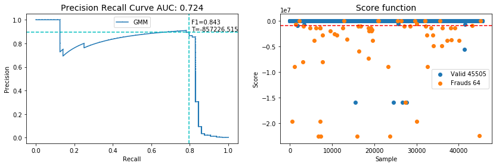
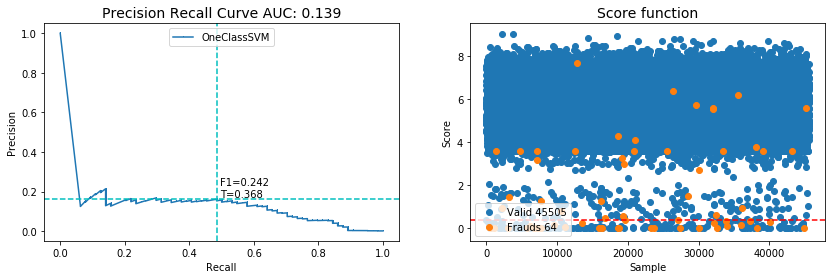

### Abstract
Supervised learning has been widely used to detect anomaly in credit
card transaction records based on the assumption that the pattern of a
fraud would depend on the past transaction. However, unsupervised
learning does not ignore the fact that the fraudsters could change their
approaches based on customers' behaviors and patterns. in this study we
will present iterative method of using mixture of Gaussian's to detect
anomaly in credit card transactions. We will compare it with iterative
method using OneClassSVM. In each method our algorithm utilizes the
model functions(likelihood and shifted from support vector) scores,
evaluates samples with their scores and samples score under threshold T
consider to be anomalies. the described method is iterative until model
converges or max iteration exceeds. The data set used in this study is
based on real-life data of credit card transaction. Due to the
availability of the response(labels), after training the models we can
evaluate the performance of each model. The performance of these two
methods is discussed extensively in this paper.

### Iterative GMM Results

### Iterative OnewClassSVM Results

Check out Full [Notebook](notebooks/Transactions%20Anomaly%20Detection%20with%20Unsupervised%20Learning%20.ipynb) 